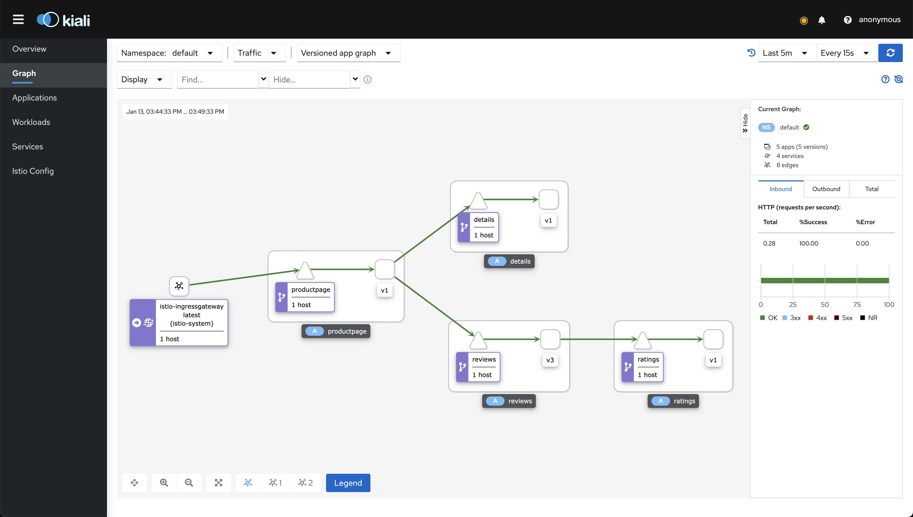
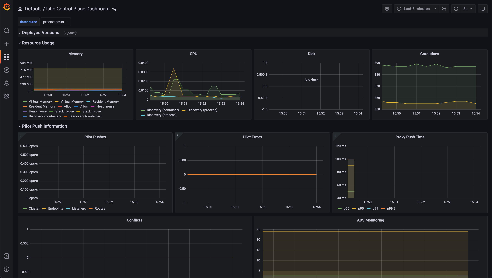
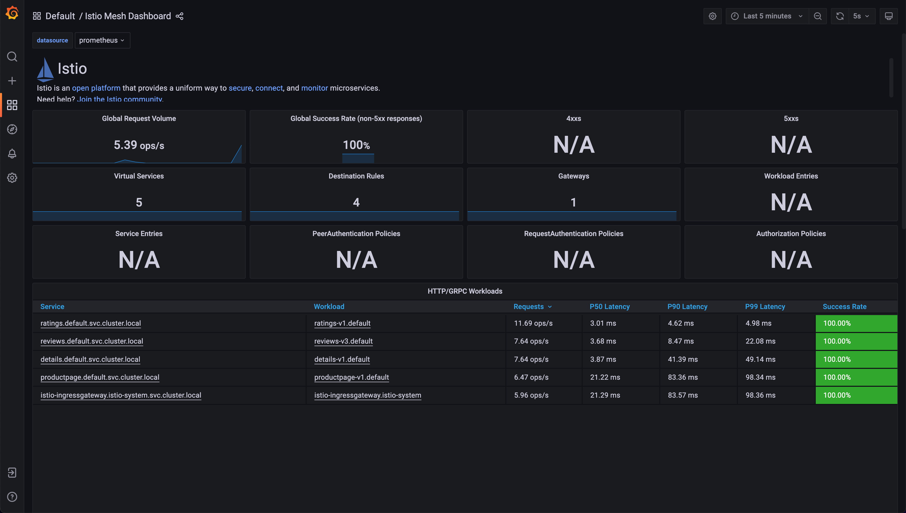
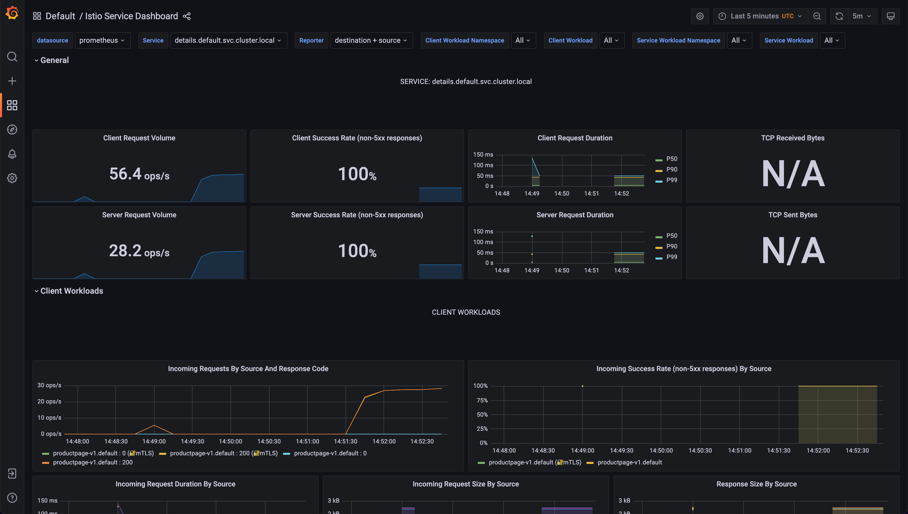
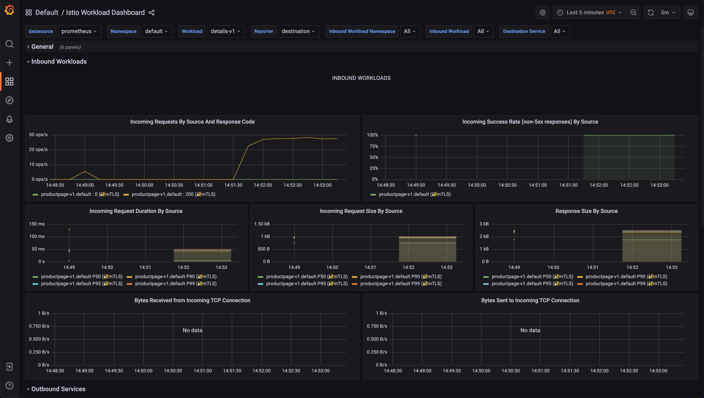

<!-- markdownlint-disable MD033 -->
<h1 align="center">
<picture>
  <source media="(prefers-color-scheme: dark)" srcset="https://raw.githubusercontent.com/sighupio/distribution/refs/heads/main/docs/assets/white-logo.png">
  <source media="(prefers-color-scheme: light)" srcset="https://raw.githubusercontent.com/sighupio/distribution/refs/heads/main/docs/assets/black-logo.png">
  
</picture><br/>
  Istio Add-On Module
</h1>
<!-- markdownlint-enable MD033 -->


<!-- <SD-DOCS> -->

**Istio add-on module** for the [SIGHUP Distribution (SD)][kfd-repo] allows to transparently add Istio Mesh capabilities to your SD cluster.

If you are new to SD please refer to the [official documentation][sd-docs] on how to get started with SD.

## Overview

**Istio add-on module** deploys Istio service mesh into a Kubernetes cluster. A service mesh, such as Istio, allows to transparently add capabilities like observability, traffic management, and security to applications, without modifying their source code. These capabilities are of great value when running microservices at scale or under strict security requirements.

### Istio

This module features the Istio Project. Istio provides behavioral insights and operational control over the service mesh as a whole, offering a complete solution to satisfy the diverse requirements of microservice applications.

Read more on [Istio's documentation site][istio-docs-site].

## Packages

Istio add-on module provides the following packages:

| Package                                  | Version   | Description                                                                                                                                                               |
| ---------------------------------------- | --------- | ------------------------------------------------------------------------------------------------------------------------------------------------------------------------- |
| [Istio](katalog/istio) | `v1.25.2` | Istio package, includes 2 different profiles: `sidecar` and `istio-platform`. |
| [Jaeger](katalog/jaeger) | `v1.65.0` | Jaeger package, including Jager, the Jaeger Operator |
| [Kiali](katalog/kiali) | `v2.9.0` | Kiali package.                                                       |

## Compatibility

| Kubernetes Version |   Compatibility    | Notes           |
| ------------------ | :----------------: | --------------- |
| `1.29.x`           | :white_check_mark: | No known issues |
| `1.30.x`           | :white_check_mark: | No known issues |
| `1.31.x`           | :white_check_mark: | No known issues |
| `1.32.x`           | :white_check_mark: | No known issues |

Check the [compatibility matrix][compatibility-matrix] for additional information about previous releases of the modules.

## Usage

### Prerequisites

| Tool                                    | Version    | Description                                                                                                                                                    |
| --------------------------------------- | ---------- | -------------------------------------------------------------------------------------------------------------------------------------------------------------- |
| [furyctl][furyctl-repo]                 | `>=0.6.0`  | The recommended tool to download and manage SD modules and their packages. To learn more about `furyctl` read the [official documentation][furyctl-repo].     |
| [kustomize][kustomize-repo]             | `>=3.9.1`  | Packages are customized using `kustomize`. To learn how to create your customization layer with `kustomize`, please refer to the [repository][kustomize-repo]. |
| [SD Monitoring Module][kfd-monitoring] | `>=1.11.1` | To have functioning metrics, dashboards and alerts. Prometheus Operator is also required by Kiali.                                                             |
| [SD Logging Module][kfd-logging]       | `>=1.7.1`  | When using tracing, ElasticSearch / OpenSearch is used as storage.                                                                                             |

### Istio deployment

1. To start using Istio add-on module, add to your `Furyfile.yaml` the module as a base:

```yaml
versions:
  service-mesh: v4.0.0

bases:
  - name: service-mesh
```

> See `furyctl` [documentation][furyctl-repo] for additional details about `Furyfile.yaml` format.

2. Execute the following command to download the packages to your machine:

```bash
furyctl vendor -H
```

3. Inspect the downloaded packages under `./vendor/katalog/istio` to get familiar with the content.

4. Define a `kustomization.yaml` with that includes the `./vendor/katalog/istio` directory as a resource:

```yaml
resources:
    - ./vendor/katalog/istio/profiles/sidecar/base
```

> You can point to one of the predefined profiles here.

5. Finally, to deploy the selected profile to your cluster, execute:

```shell
kustomize build . | kubectl apply -f -
```

For further details please refer to each package's directory in this repository.

### Istio Monitoring

The Service Mesh Module not only provides you with Kiali to visualize the status of the service mesh from a UI, but also includes metrics, dashboards and alerts for Istio's components out-of-the-box.

You can monitor the status of Istio, the service-mesh itself and its components from the provided Grafana Dashboards. Here are some screenshots:

<!-- markdownlint-disable MD033 -->
<a href="docs/images/screenshots/kiali.png"></a>
<a href="docs/images/screenshots/istio-control-plane-dashboard.png"></a>
<a href="docs/images/screenshots/istio-mesh-darshboard.png"></a>
<a href="docs/images/screenshots/istio-service-dashboard.png"></a>
<a href="docs/images/screenshots/istio-workload-dashboard.png"></a>
<!-- markdownlint-enable MD033 -->

> click on each screenshot for the full screen version

The following set of alerts is included:

| Alert Name                         | Summary                                                                                                                                             | Description                                                                                     |
| ---------------------------------- | --------------------------------------------------------------------------------------------------------------------------------------------------- | ----------------------------------------------------------------------------------------------- |
| IstioMetricsMissing                | Istio Metrics missing                                                                                                                               | [Critical]: Check prometheus deployment or whether the prometheus filters are applied correctly |
| HTTP5xxRateHigh                    | 5xx rate too high                                                                                                                                   | The HTTP 5xx errors rate higher than 0.05 in 5 mins                                             |
| WorkloadLatencyP99High             | -                                                                                                                                                   | The workload request latency P99 > 160ms                                                        |
| IngressLatencyP99High              | -                                                                                                                                                   | The ingress latency P99 > 250ms                                                                 |
| ProxyContainerCPUUsageHigh         | Proxy Container CPU usage (namespace {{ $labels.namespace }}) (pod {{ $labels.pod }}) (container {{ $labels.container }})  VALUE = {{ $value }}.    | Proxy Container CPU usage is above 80%                                                          |
| ProxyContainerMemoryUsageHigh      | Proxy Container Memory usage (namespace {{ $labels.namespace }}) (pod {{ $labels.pod }}) (container {{ $labels.container }})  VALUE = {{ $value }}. | Proxy Container Memory usage is above 80%                                                       |
| IngressMemoryUsageIncreaseRateHigh | Ingress proxy Memory change rate, VALUE = {{ $value }}.                                                                                             | Ingress proxy Memory Usage increases more than 200 Bytes/sec                                    |
| IstiodContainerCPUUsageHigh        | Istiod Container CPU usage (namespace {{ $labels.namespace }}) (pod {{ $labels.pod }}) (container {{ $labels.container }}) VALUE = {{ $value }}.    | Isitod Container CPU usage is above 80%                                                         |
| IstiodMemoryUsageHigh              | Istiod Container Memory usage (namespace {{ $labels.namespace }}) (pod {{ $labels.pod }}) (container {{ $labels.container }}) VALUE = {{ $value }}. | Istiod Container Memory usage is above 80%                                                      |
| IstiodMemoryUsageIncreaseRateHigh  | Istiod Container Memory usage increase rate high, VALUE = {{ $value }}.                                                                             | Istiod Container Memory usage increases more than 1k Bytes/sec                                  |
| IstiodxdsPushErrorsHigh            | istiod push errors is too high                                                                                                                      | istiod push error rate is higher than 0.05                                                      |
| IstiodxdsRejectHigh                | istiod rejects rate is too high                                                                                                                     | istiod rejects rate is higher than 0.05                                                         |
| IstiodContainerNotReady            | istiod container not ready                                                                                                                          | container: discovery not running                                                                |
| IstiodUnavailableReplica           | Istiod unavailable pod                                                                                                                              | Istiod unavailable replica > 0                                                                  |
| Ingress200RateLow                  | ingress gateway 200 rate drops                                                                                                                      | The expected rate is 100 per ns, the limit is set based on 15ns                                 |

<!-- links -->
[kfd-repo]: https://github.com/sighupio/distribution
[istio-docs-site]: https://istio.io/latest/about/service-mesh/
[furyctl-repo]: https://github.com/sighupio/furyctl
[kustomize-repo]: https://github.com/kubernetes-sigs/kustomize
[sd-docs]: https://docs.kubernetesfury.com/docs/distribution/
[compatibility-matrix]: https://github.com/sighupio/add-on-istio/blob/master/docs/COMPATIBILITY_MATRIX.md

[kfd-monitoring]: https://github.com/sighupio/fury-kubernetes-monitoring
[kfd-logging]: https://github.com/sighupio/fury-kubernetes-logging
<!-- </SD-DOCS> -->

<!-- <FOOTER> -->
## Contributing

Before contributing, please read first the [Contributing Guidelines](docs/CONTRIBUTING.md).

### Reporting Issues

In case you experience any problems with the module, please [open a new issue](https://github.com/sighupio/add-on-istio/issues/new/choose).

## License

This module is open-source and it's released under the following [LICENSE](LICENSE)
<!-- </FOOTER> -->
