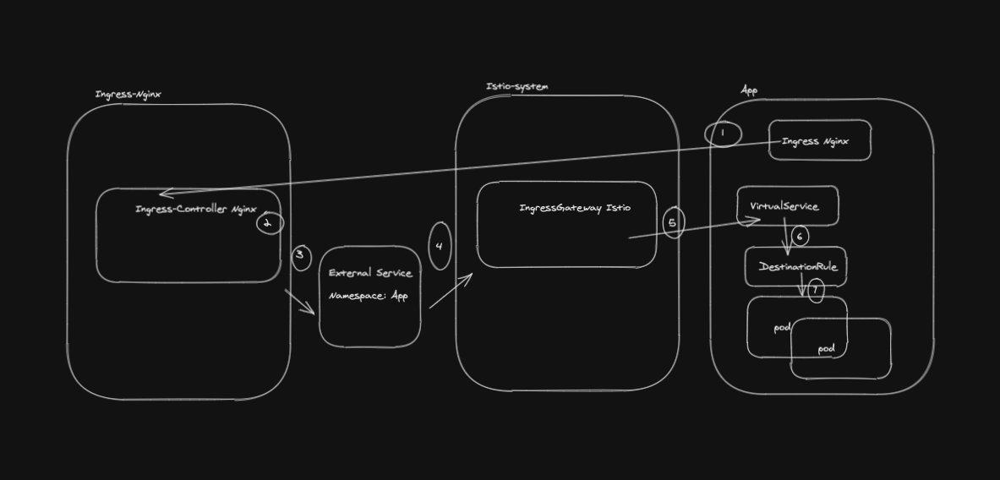

g# For mTLS with nginx

### Ingress Controller Nginx

1. label the ingress-nginx with the `istio-injection=enabled`
2. crete the following crd:

```yaml
apiVersion: "security.istio.io/v1beta1"
kind: "PeerAuthentication"
metadata:
    name: "default"
spec:
    mtls:
        mode: PERMISSIVE
```

3. put the following annotation in the Daemonset in `/spec/template`:

```yaml
annotations:
    traffic.sidecar.istio.io/excludeInboundPorts: 80,443
    traffic.sidecar.istio.io/includeInboundPorts: ""
```

### Microservice with mTLS strict

1. in the namespace of your applications just put this crd:

```yaml
apiVersion: "security.istio.io/v1beta1"
kind: "PeerAuthentication"
metadata:
    name: "default"
spec:
    mtls:
        mode: STRICT
```

2. For each ingress you create for exposing your service, remember to add those 2 annotations in it:

```yaml
# this is the way: 1 service, 1 ingress for making Mtls working with the annotation above
nginx.ingress.kubernetes.io/service-upstream: "true"
nginx.ingress.kubernetes.io/upstream-vhost: productpage.test.svc.cluster.local
```

This will enable the traffic from the ingress to a service deployed in a namespace with a mTLS in STRICT mode

### Enable Tracing for application using nginx ingress controller

Is pretty tricky to preserve both ingress nginx functionality and in the same keep of Istio tracing advantages, but somehow is possible to do that.

Given the application "hello" in a namaspace "test", you have to do the following stuff:

1. create virtualservice for your app

```yaml
apiVersion: networking.istio.io/v1beta1
kind: VirtualService
metadata:
  name: hello
  namespace: test
spec:
  gateways:
  - hello-gateway
  hosts:
  - '*'
  http:
  - match:
    - uri:
        exact: /productpage
    - uri:
        prefix: /static
    - uri:
        exact: /login
    - uri:
        exact: /logout
    - uri:
        prefix: /api/v1/products
    route:
    - destination:
        host: productpage # => service name of your app
        port:
          number: 9080
```

2) create the destinationrule for your app

```yaml
apiVersion: networking.istio.io/v1beta1
kind: DestinationRule
metadata:
  name: hello
  namespace: test
spec:
  host: productpage
  subsets:
  - labels:
      version: v1
    name: v1
```
3) create an external service that point to the ingressGateway Service (that is deployed in a separate ns):

```yaml

kind: Service
apiVersion: v1
metadata:
  name: hello-istio-ingress
spec:
  type: ExternalName
  externalName: istio-ingressgateway.istio-system.svc.cluster.local
```

4) fix your ingress accordingly with that:

```yaml
apiVersion: networking.k8s.io/v1
kind: Ingress
metadata:
  annotations:
    kubernetes.io/ingress.class: nginx
    nginx.ingress.kubernetes.io/service-upstream: "true"
    nginx.ingress.kubernetes.io/upstream-vhost: productpage # => the name of the virtualservice that the ingressGateway is expecting to match
  name: productpage
  namespace: test
spec:
  rules:
  - host: productpage.sighup-staging.localdomain
    http:
      paths:
      - backend:
          service:
            name: hello-istio-ingress # the name of the external service that we did before
            port:
              number: 80
        path: /
        pathType: Prefix
```


In this way this is what is going to happen:



